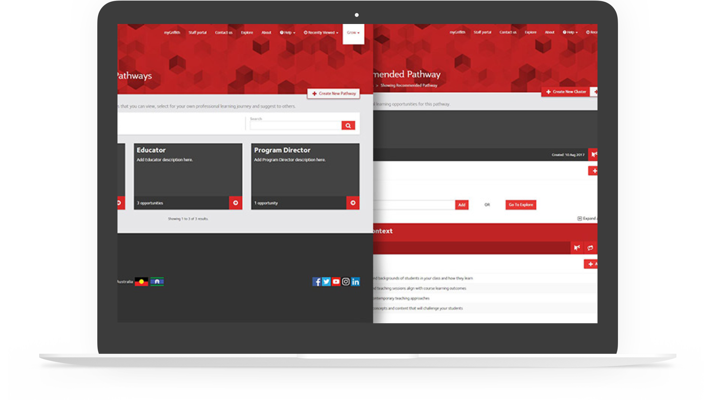

# Griffith Learn

An online professional learning tool to assist Griffith staff in creating and managing their learning Pathways for Professional Development.

**2017 - 2018**

## Business Need

Griffith needed a tool for developing learning pathways, with capabilities for collaboration between academics.

## Our Solution

A Laravel and Oracle DB web application with SSO integration. Data for entries to support learning pathways was sourced from another application I contributed to ExLNT.

## My Contribution

As a web application developer, my focus was on the Laravel and Oracle DB components of the system but I have assisted in the development of all aspects of the application.

## Technologies

Laravel,
Git,
GitLab,
Griffith,
JavaScript,
jQuery,
Oracle DB,
PHP,
RHEL,
Scss,
Subversion,
