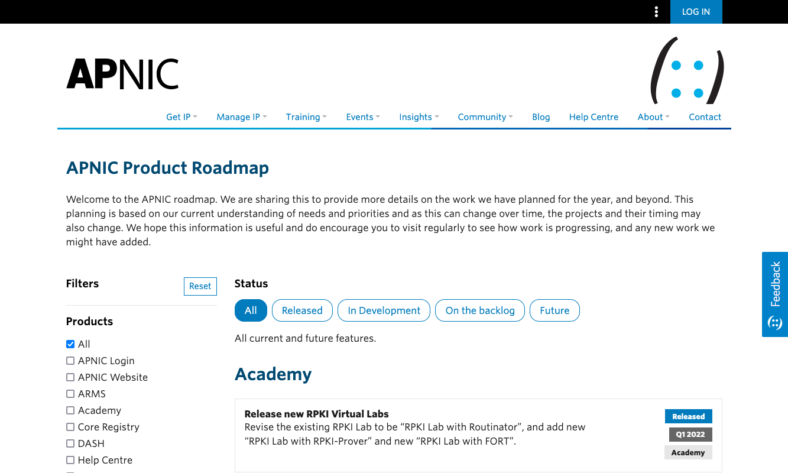

# APNIC Product Roadmap

Platform for sharing APNIC's public Product Roadmap to our community.

**2022 - Now**

[roadmap.apnic.net](https://roadmap.apnic.net/)

## Business Need

APNIC needs to share what we plan to do on our roadmap, so that we can support our goal to be a transparent organization.

## Our Solution

A ReactJS application running on the AWS Amplify platform.

## My Contribution

I was responsible for taking ownership of this product which was orriginally developed by our Academy Product Team, and then modifying it to function as a platform for all of APNIC to use.

## Technologies

-   AWS Amplify
-   TypeScript
